# Ideer

## Struktur på oplæg
Start alle oplæg med følgende 3 punkter:

   1. Hurtig intro til CIA,    
   2. en oplistning af risici fra [1. kursusgang](../undervisning/01-kursusgang.md) og    
   3. en fremhævning de risici, der gælder særligt for pågældende emne.

Mindmaps:

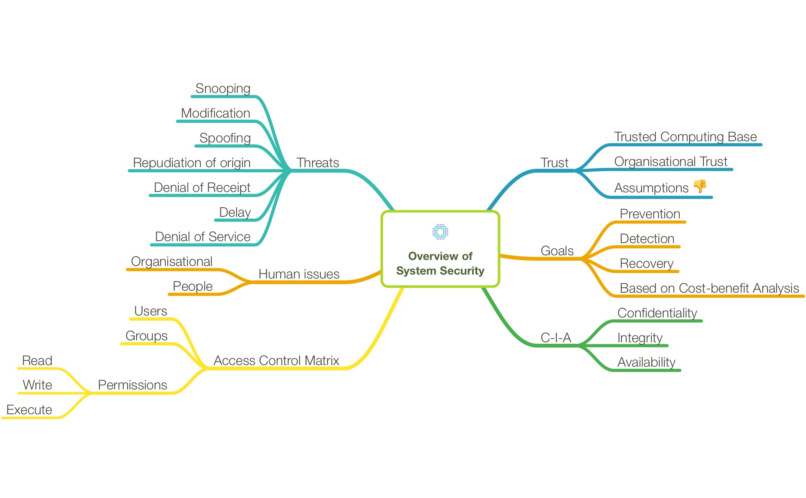
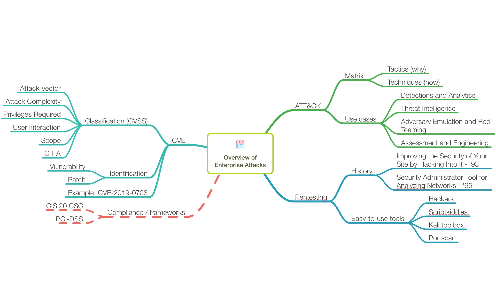
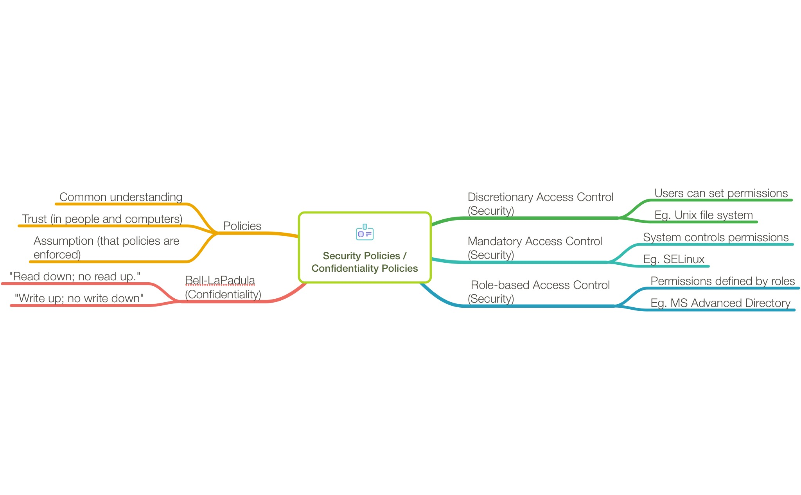
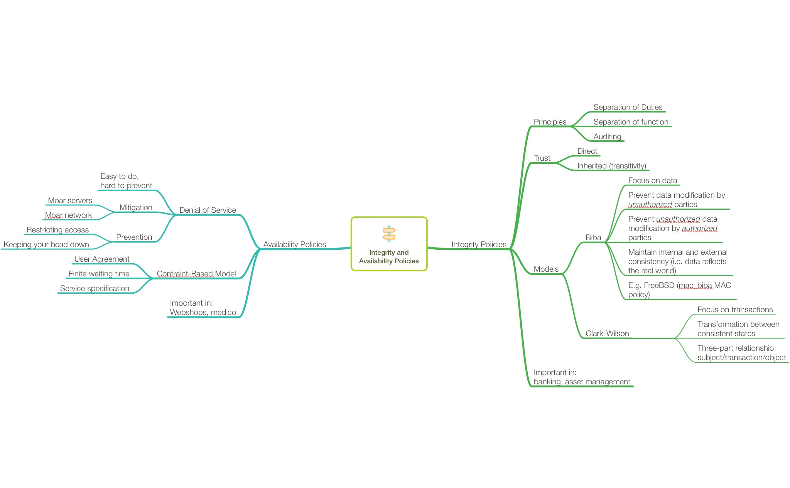
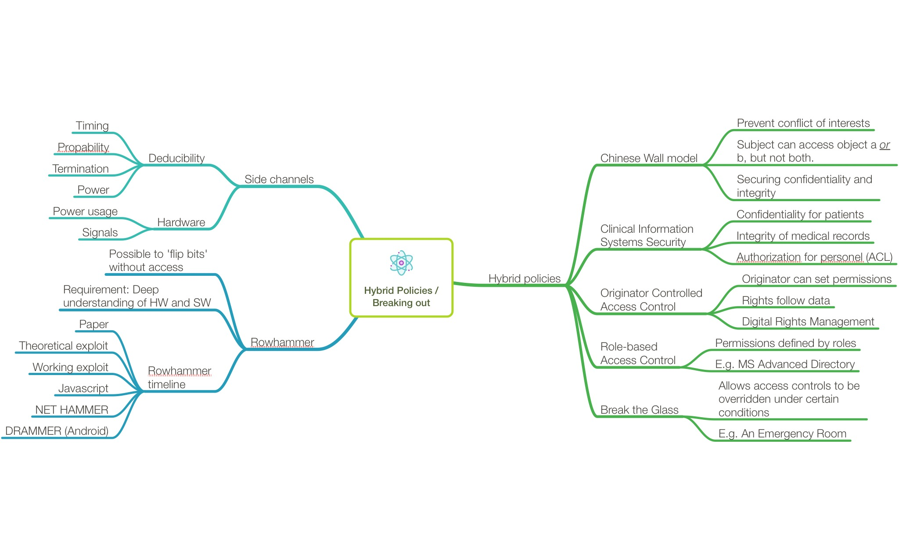
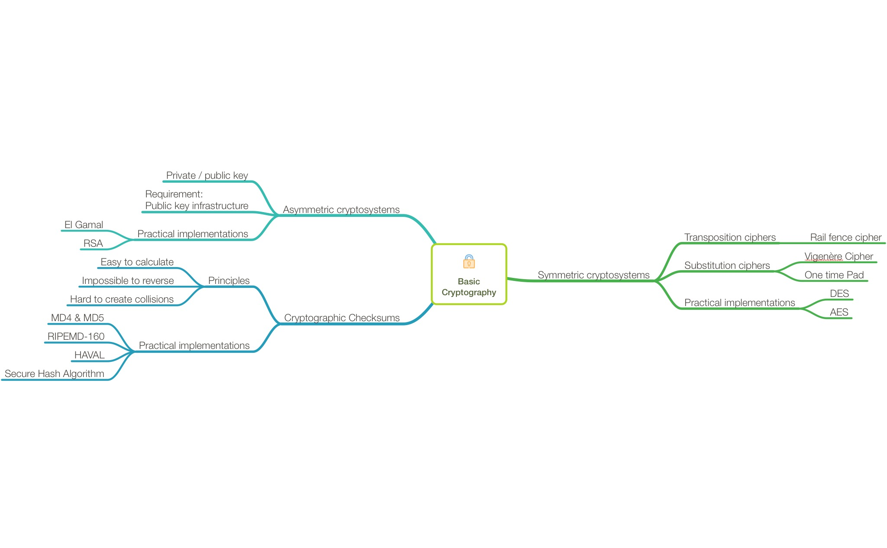
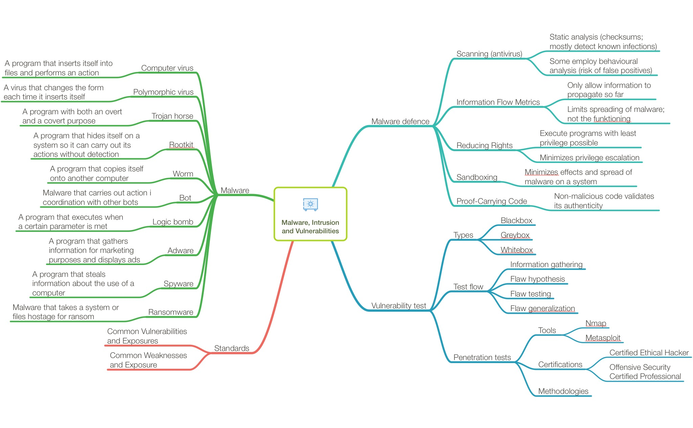
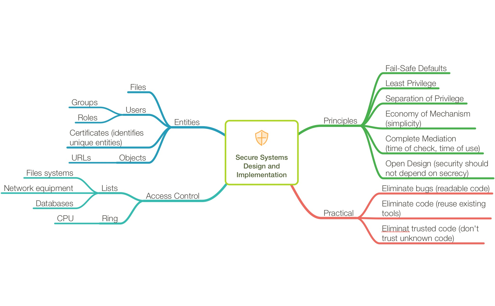
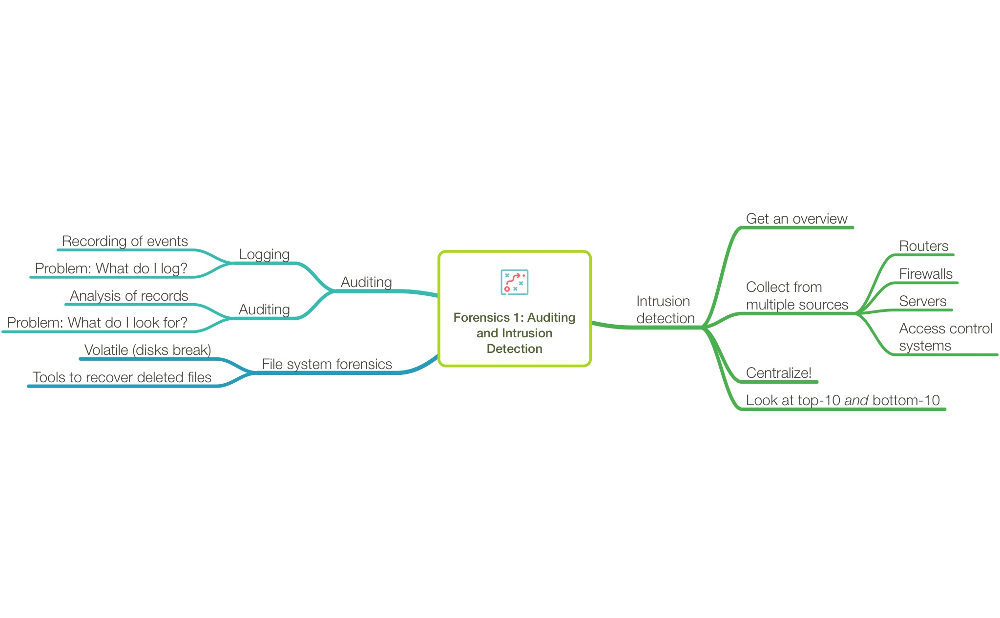
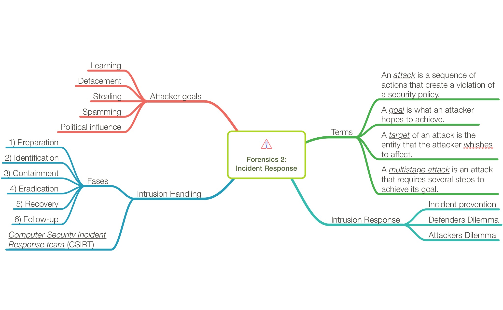
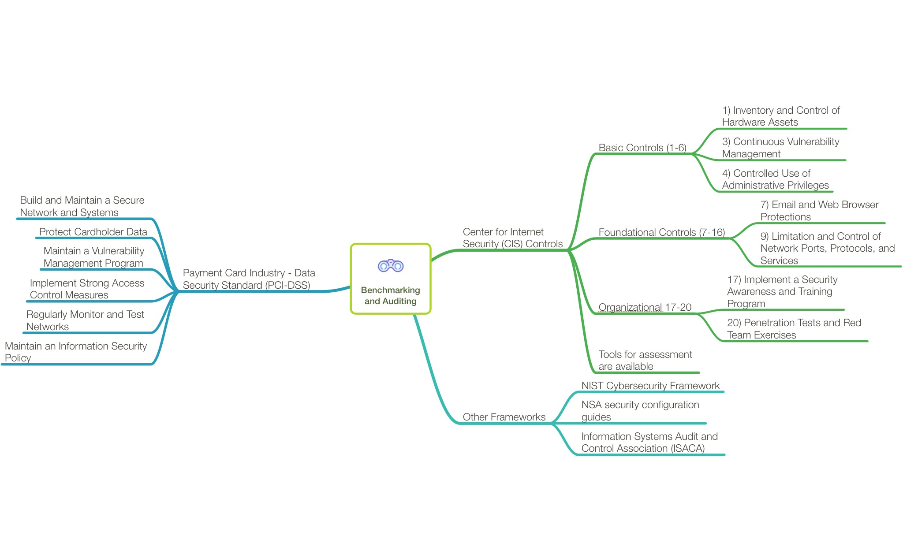
