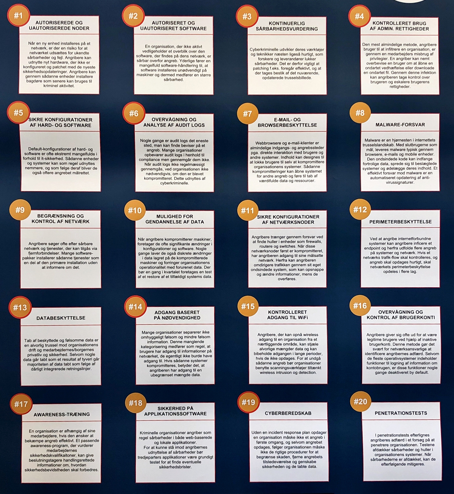

# 13 - Benchmarking and Auditing Recap

## Noter til dagens tekst

!!! note "Resumé af '[indsæt overskrift]' (kap. XX)"

## Noter fra undervisningen

## CIS20CSC

Dette er en test for at se hvordan det er at skrive her[^1].

!!! Note
    Husk at man kan lave en blok med en note midt i det hele. Det er sådan set ret blæret. Man skal bare huske syntaken. Men sådan er det jo at skrive i markdown.

[^1]: Man kan også bruge fodnoter.  
