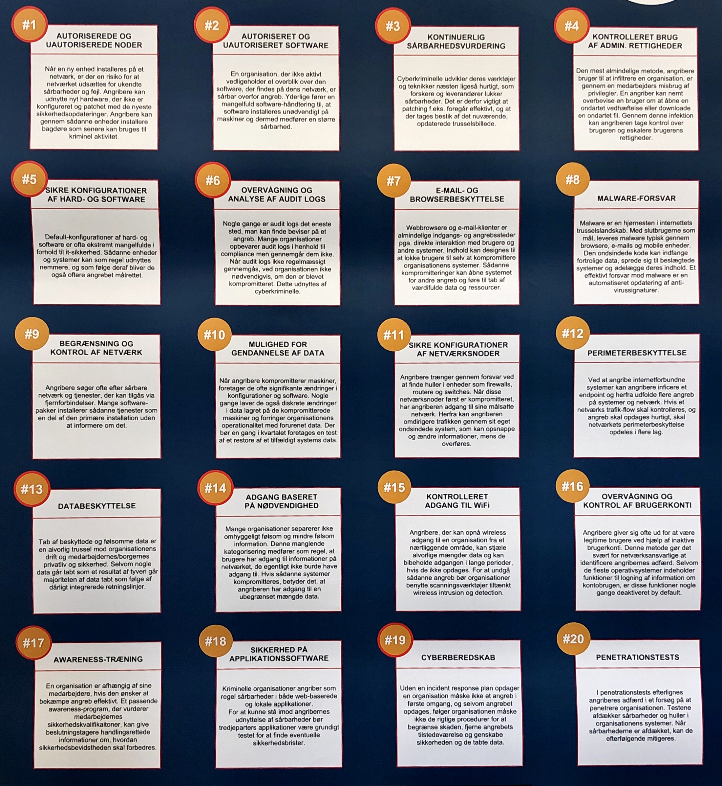

# 14 - {EMNE}

## Noter til dagens tekst

!!! note "Resumé af '[indsæt overskrift]' (kap. XX)"

*Find gerne tre spørgsmål til dages tekst, som skal søges besvaret i løbet af undervisningen. Det kan være eks. forståelsesmæssige spm. til anvendelighed af stoffet eller generel perspektivering.*

1. {Spørgsmål 1}
2. {Spørgsmål 2}
3. {Spørgsmål 3}

## Noter fra undervisningen

Dette er en test for at se hvordan det er at skrive her[^1]. Umiddelbart er det jo bare som at skrive tekst normalt. Men der skal selvfølgelig også kunne indsættes billeder ol.

Lorem ipsum dolor sit amet, consectetur adipiscing elit. Cras arcu libero,
mollis sed massa vel, *ornare viverra ex*. Mauris a ullamcorper lacus. Nullam
urna elit, malesuada eget finibus ut, ullamcorper ac tortor. Vestibulum sodales
pulvinar nisl, pharetra aliquet est. Quisque volutpat erat ac nisi accumsan
tempor.

**Sed suscipit**, orci non pretium pretium, quam mi gravida metus, vel
venenatis justo est condimentum diam. Maecenas non ornare justo. Nam a ipsum
eros. [Nulla aliquam](#) orci sit amet nisl posuere malesuada. Proin aliquet
nulla velit, quis ultricies orci feugiat et. `Ut tincidunt sollicitudin`

!!! Note
    Husk at man kan lave en blok med en note midt i det hele. Det er sådan set ret blæret. Man skal bare huske syntaksen. Men sådan er det jo at skrive i markdown.

[^1]: Man kan også bruge fodnoter.
